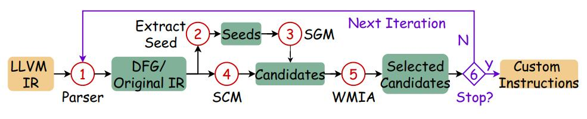

# CIExplorer: Microarchitecture-Aware Exploration for Tightly Integrated Custom Instruction (ICS'25)

## Citation
> Xiaoyu Hao, Sen Zhang, Liang Qiao, Qingcai Jiang, Jun Shi, Junshi Chen, Hong An, Xulong Tang, Hao Shu, and Honghui Yuan. 
> CIExplorer: Microarchitecture-Aware Exploration for Tightly Integrated Custom Instruction. In 2025 International Conference on Supercomputing (ICS ’25)

# Requirements & Setup
- LLVM-14
- YAML
- Python 3.10

```bash
sudo apt install llvm-14 clang-14 libyaml-cpp-dev
```

# Compile
## Compile LLVM passes

```bash
cd src/passes
mkdir build && cd build
cmake ..
make -j
```

## Compile mining code

Change EXECUTABLE_OUTPUT_PATH in src/mining/CMakeLists.txt first,

```bash
set(EXECUTABLE_OUTPUT_PATH "path/to/patt_mining/bin/executables")
```

and then compile all executables

```bash
cd src/mining
mkdir build && cd build
cmake ..
make -j
```

# Workflow



# Code Structure

- Root Directory
    - README.md
    - src
    	- galgo -> Genetic Algorithm Implementation based on https://github.com/olmallet81/GALGO-2.0
		- gspan -> Seed Extraction to find recurring insn paris (Node 2) based on https://github.com/betterenvi/gSpan
    	- mining 
			- search.cpp -> Seed Growth Method (SGM) (Node 3)
			- split_bb.cpp -> Split-and-Combine Method (SCM) for basic block w/o seeds (Node 4)
			- split_bb_ino.cpp -> SCM optimized for IO GPP
			- mia.cpp -> Maximum Independent Set Analysis (Node 5)
    	- passes -> LLVM Passes
		- cost_model
			- cost_model.cpp -> Our microarchitecture-aware cost model
	- bin
		- executables # compiled binary executables will be put here
		- preprocess # some python shells to pre-process data dependency graphs
		- run_shells 
			- mining.sh # shells for iterative searching
			- mining_ino.sh # for IO GPP

# Custom Instruction Exploration

**Step 1. Enter benchmark dir you want to test and compile:**

We provide benchmarks from MachSuite that are already compiled into IR.

Download from https://github.com/charlieisacat/mach_ir.

```bash
cd /path/to/patt_mining/MachSuite/aes/aes/
make
```

**Step 2. Enter running directory:**
```bash
cd /path/to/patt_mining/bin/run_shells
```

**Step 3. Set params for running shells before running:**
```bash
export MINING_ROOT="path/to/patt_mining"
export EXECUTABLE="path/to/mach_ir/aes/aes/aes_run.bc"
export EXECARGS="path/to/mach_ir/aes/aes/input.data"
export EXCL_FILE="path/to/patt_mining/bin/run_shells/exclfile"
export Nin=1024 # maxmium live-in value
export Nout=1024 # maxmium live-out value
export NOCONST=1 # indicate if no limits for live-in/out, ONLY NOCONST=1 is supported now
```

**Step 4. Do the mining procedure:**

Preprocess:
```bash
./prepare.sh
cd patt_mining/temp
```

For a 2-wide OOO processor:
```bash
../../mining.sh /path/to/patt_mining/src/cost_model/ooo2.yml 3
```

or for a in-order processor:

```bash
../../mining_ino.sh /path/to/patt_mining/src/cost_model/ino.yml 3
```

3 is the number of arguments that PACK instruction has and xxx.yml is the target microarchitecture configuration.

**Step 5. Visualization**

Discovered CIs are visualzied automatically and images can be found in:

```bash
/path/to/patt_mining/bin/run_shells/patt_mining/temp/dfg_imgs
```


# Simulation

We provide shells to perform the exploration and simualtion end-to-end.

```bash
CIExplorer/auto
```

## Steps:

1. To use these shells you should first build the simulator in https://github.com/charlieisacat/CISim.

2. Specify correct paths in auto/config.py:

```bash
custom_adaptor = "/path/to/CISim/custom_adaptor/build/adaptor"
base_dir = "/path/to/auto/results"
mining_root = "/path/to/patt_mining"
basepath = "path/to/mach_ir"
```

3. Run shells in order.

Explore custom instructions:
```bash
python3 auto_mining.py
```

Automatically generate custom instruction represented in LLVM IR:
```bash
python3 auto_packing.py
```

Simulate:
```bash
./auto_sim.sh
```

Analyze:
```bash
python3 analyze.py
```


